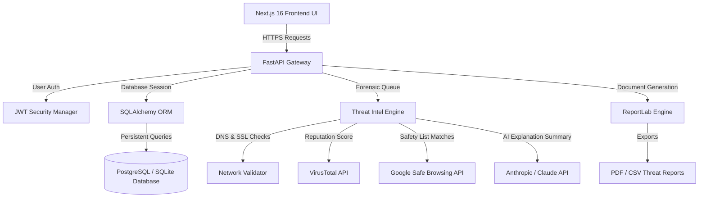

# AI Phishing Detection Platform (Sentinel)
### Enterprise-Grade Python & Next.js Cybersecurity Architecture

An advanced, light-themed AI-powered phishing detection and threat forensic platform. This application integrates real-time URL analysis, suspicious email text heuristics, and automated report generation under a secure, responsive, and animated dashboard.

---

## 1. Objectives & Value Proposition
* **Active Phishing Mitigation**: Resolves and scans URLs and message bodies using multi-agent verification modules.
* **Deep Forensic Pipeline**: Cross-references targets with active WHOIS databases, SSL/TLS certificate chains, recursive redirect tracks, global threat blocklists (VirusTotal, Google Safe Browsing), and AI NLP heuristics.
* **Enterprise Telemetry**: Provides real-time threat maps, severity logs, administrative privilege controls, and audit logs.
* **Modern Development Portfolio**: Features a premium light design constructed with **Next.js 16**, **TypeScript**, **Tailwind CSS v4**, **Framer Motion**, and a robust **FastAPI + PostgreSQL** backend.

---

## 2. Platform Architecture & Data Flow



---

## 3. Technology Stack & Modern Implementations

### Frontend Component Layer
* **Core Framework**: Next.js 16 (App Router) & TypeScript.
* **Style Engine**: Tailwind CSS v4 featuring soft slate canvas grids, indigo accent gradients, and custom glassmorphic boundaries.
* **Animations**: Framer Motion orchestrating spring-physics page entries, modal transitions, and interactive scale gestures.
* **Tactile 3D Cards (`TiltCard`)**: Implements mouse-movement spotlight tracking and 3D rotations, with support for `prefers-reduced-motion`.
* **Radar Security Sweep (`RadarScanner`)**: A custom-drawn concentric radar widget that visually scans endpoints in real time.
* **Typewriter Forensics (`TypewriterText`)**: Streams AI explanation strings with a typing caret effect.

### Backend Services Layer
* **Framework**: FastAPI (Asynchronous Python REST API).
* **Database Access**: SQLAlchemy 2.0 with alembic schema migrations.
* **Authentication**: PyJWT token hashing, bcrypt credentials encryption, and OAuth2 security dependencies.
* **External Scans**:
  * **VirusTotal API v3**: Resolves URL identifiers in base64, fetches analysis reports, and triggers scans for new hosts.
  * **Google Safe Browsing API v4**: Cross-references threats against threat matches lists (Malware, Social Engineering, PUA).
* **Forensic Exporting**: ReportLab document layout engines generating structural PDF reports and standard CSV matrices.

---

## 4. Suggested Database Schema

### `users` Table
Stores authentication metadata, credentials, and organizational access roles.
* `id` (Integer, Primary Key)
* `name` (String, Non-Nullable)
* `email` (String, Unique, Indexed)
* `hashed_password` (String, Non-Nullable)
* `role` (String, Defaults to `'user'`)
* `is_active` (Boolean, Defaults to `True`)
* `created_at` (DateTime, Defaults to `now()`)

### `scan_history` Table
Tracks active scans, results, risk thresholds, and targets.
* `id` (Integer, Primary Key)
* `user_id` (Integer, ForeignKey -> `users.id`)
* `scan_type` (String, e.g., `'URL'` or `'TEXT'`)
* `content` (Text, Target query)
* `result` (String, `'SAFE'` or `'PHISHING'`)
* `risk_score` (Integer, 0 to 100)
* `risk_level` (String, `'LOW'`, `'MEDIUM'`, `'HIGH'`, or `'CRITICAL'`)
* `created_at` (DateTime, Defaults to `now()`)

### `reports` Table
Stores generated structural metadata linked to scans.
* `id` (Integer, Primary Key)
* `scan_id` (Integer, ForeignKey -> `scan_history.id`)
* `user_id` (Integer, ForeignKey -> `users.id`)
* `report_type` (String, e.g., `'PDF'` or `'CSV'`)
* `details` (Text, Analysis overview)
* `created_at` (DateTime, Defaults to `now()`)

### `activity_logs` Table
Audit logs representing security activities.
* `id` (Integer, Primary Key)
* `user_id` (Integer, ForeignKey -> `users.id`)
* `action` (String, e.g., `'USER_LOGIN'`)
* `description` (Text)
* `ip_address` (String, Optional)
* `created_at` (DateTime, Defaults to `now()`)

---

## 5. Development Directory Structure

```text
ai-phishing-detection-platform/
 ├── app/                             # Next.js 16 App Directory
 │    ├── login/                      # User Login Page
 │    ├── register/                   # User Registration Page
 │    ├── dashboard/                  # Dashboard Shell & Layout
 │    │    ├── scanner/               # Deep Threat Scanner
 │    │    ├── email-analysis/        # Email Forensics Analyzer
 │    │    ├── analytics/             # Threat Trends & Severity Charts
 │    │    ├── reports/               # Threat PDF/CSV Report Lists
 │    │    ├── team/                  # Operators Directory
 │    │    ├── settings/              # API Token & MFA Configuration
 │    │    └── admin/                 # Control Center Auditing Logs
 │    └── globals.css                 # Theme variables & glassmorphism
 ├── components/                      # Shared React Components
 │    ├── layout/                     # Shell, Navbar, Sidebar
 │    └── ui/                         # TiltCard, RadarScanner, TypewriterText
 ├── lib/                             # Axios client & JWT storage helpers
 └── backend/                         # FastAPI Backend
      ├── app/
      │    ├── database/              # session.py, base.py
      │    ├── models/                # SQLAlchemy Models
      │    ├── schemas/               # Pydantic Schemas
      │    ├── routers/               # Auth, Scans, Reports routers
      │    └── services/              # Threat intel, auth logic services
      ├── tests/                      # Automated unittest suite
      └── main.py                     # Entry point
```

---

## 6. Verification & Automated Testing

The backend includes a verification test suite checking security validations, login rejections, and authentication guards.

### Running Backend Tests
Execute in the `backend/` directory:
```powershell
# Run the test suite
./venv/Scripts/python -m unittest tests/test_endpoints.py
```

### Running the Application Locally
1. **Launch FastAPI Backend (Port 8001)**:
   ```powershell
   cd backend
   ./venv/Scripts/python -m uvicorn main:app --reload --port 8001
   ```
2. **Launch Next.js Dev Server (Port 3000)**:
   ```powershell
   cd frontend
   npm run dev
   ```

---

## 7. Learning & Reference Resources
* **FastAPI Backend Guides**: [FastAPI Documentation](https://fastapi.tiangolo.com/)
* **ORM Query Systems**: [SQLAlchemy Documentation](https://www.sqlalchemy.org/)
* **Next.js Frontend Guidelines**: [Next.js Reference](https://nextjs.org/docs)
* **Cybersecurity Frameworks**: [OWASP Phishing Identification](https://owasp.org/)
* **Malicious Telemetry Feeds**: [VirusTotal Developer API](https://docs.virustotal.com/reference/api-overview)
